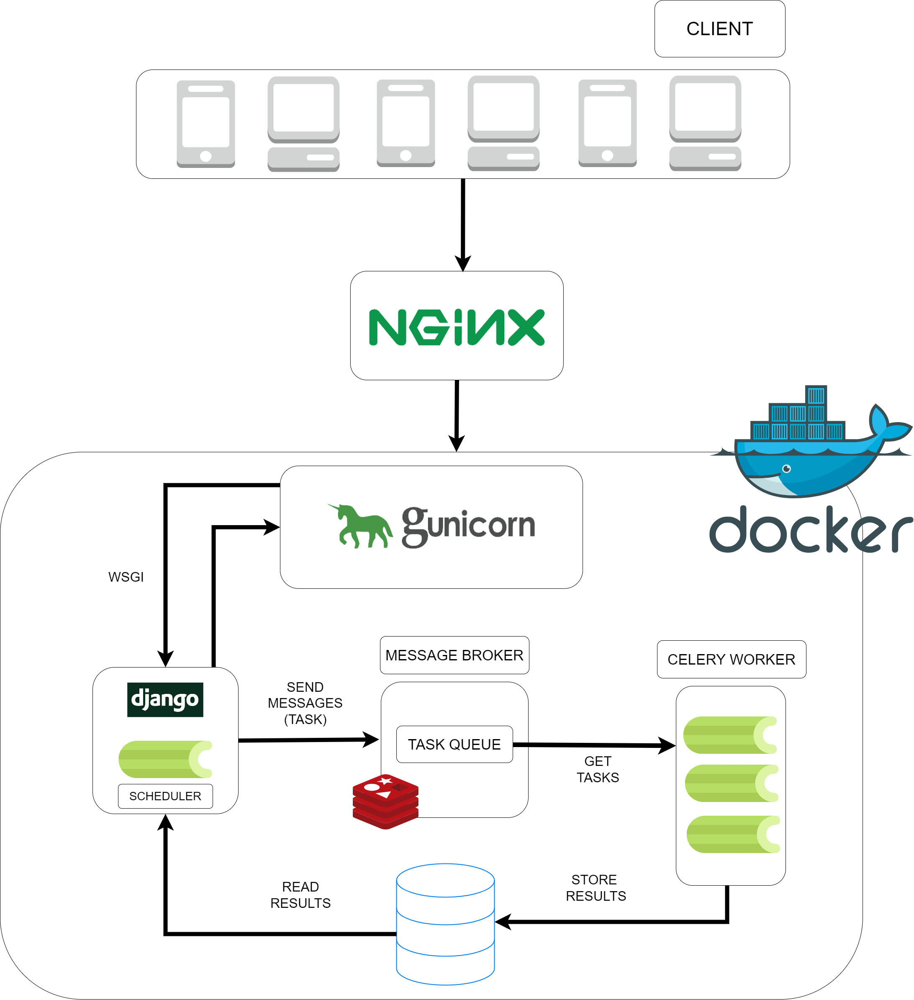

# DalalStreet

This GitHub repository hosts an online stock market simulator, designed to provide an immersive learning and practice environment for aspiring traders. The simulator enables users to experience the dynamics of real-world stock trading without risking actual capital. Gain hands-on experience by creating virtual portfolios, executing trades, and monitoring the performance of your investments in a simulated market environment.

**System Design**

